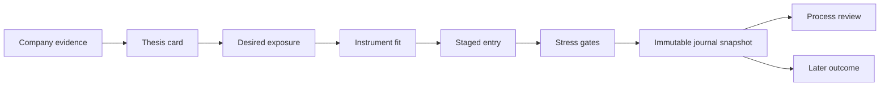

# Decision Center

Sources: `src/gbb_terminal/decision_center/`, `src/gbb_terminal/api/routes/decision_center.py`, and `app/web/src/features/decision-center/decision-center.tsx`

The Decision Center is a local research record that connects Company Intelligence evidence to a personal risk policy. It does not recommend a trade, rank an instrument as optimal, or place an order. Strategy definitions remain reusable signal logic; Decision Center records are company-scoped judgments and portfolio choices.

## Decision chain

The browser exposes this flow at `/?lab=decision&ticker=NVDA`. Company Intelligence links directly to the same company Decision Center. Missing operations, guidance, relationship, option-chain, portfolio, or policy data remains visible as incomplete context; it never silently promotes a thesis or prevents the user from retaining a Watch record.

## DRC-02 — Thesis card

`ThesisCardInput` stores a user-owned status, evidence strength, moat assessment, risks, catalysts, invalidation criteria, rationale, and optional evidence-span links. Supported statuses are Watch, Insufficient Evidence, Ready For Position Planning, and Invalidated.

- Status changes occur only in an explicit user save. No provider or LLM may auto-promote a thesis.
- Ready and Invalidated statuses require at least one invalidation criterion.
- `ThesisEvidenceLinkInput` points to an existing Company Intelligence `evidence_span`. The service copies source, URL, title, exact text, and `known_at` into the saved version.
- Exact sourced text and the user's interpretation are separate fields and separate visual blocks.
- Every save appends an immutable thesis version; explicit snapshots remain unchanged after later edits.

## DRC-03 — Position sizing and instrument fit

`PositionIntent` defines target and maximum company exposure before instrument selection. Either amount or percentage may be used for each boundary. Current shares and exposure come from the optional manual portfolio context.

`DecisionCenterEngine.analyze_expression()` evaluates direct shares or a validated Option Lab request. Cash-secured puts include strike, premium, effective acquisition basis, gross assignment obligation, 100-share granularity, existing and post-assignment shares, post-assignment exposure, collateral, cash remaining, and maximum loss. Results contain PASS, WARN, FAIL, INCOMPLETE, or NOT APPLICABLE checks for:

- Instrument/objective eligibility.
- Maximum single-name exposure.
- Maximum assignment exposure.
- Minimum unencumbered cash reserve.
- Maximum short-option collateral.
- Portfolio stress-loss ceiling.

Every check returns inspectable arithmetic and a reason. Missing portfolio context or policy produces an Incomplete fit instead of fabricated assumptions.

## DRC-04 — Expression comparator

The comparator supports Ownership Now, Accumulate Lower, Generate Income, and Defined-Risk Upside objectives. It evaluates direct shares plus eligible current cash-secured-put, long-option, vertical-spread, or covered-call candidates returned by the existing Option Lab planner. It describes sizing flexibility, capital/collateral, assignment, upside, downside, break-even, and policy fit without calling any candidate best or optimal.

Option-chain failure does not erase direct-share planning. The response contains a visible warning and deep links to Strategy Lab and Option Lab for the same validated ticker.

## DRC-05 — Entry planning and stress

`EntryPlan` stores versioned tranches with allocation amount or percentage, state, trigger, rationale, preferred price, and maximum acceptable execution price. Execution modes are Patient, Establish Exposure, and Catalyst-Aware. Escape choices are Abandon And Wait, Reassess Thesis, and Allow Starter Within Maximum.

The browser starts with Starter, Confirmation, and Opportunity Reserve tranches. Unallocated target exposure remains visible as a reserve rather than being silently redistributed.

`DecisionCenterEngine.stress_expression()` performs server-side pricing. The default browser scenarios combine stock changes of -20%, -40%, and -60% with IV expansion and time-forward assumptions. Direct shares use deterministic share P&L; options reuse the Python Option Lab pricing engine. Each result reports position P&L, portfolio P&L percentage, post-stress concentration, cash, assignment, collateral, assumptions, limitations, and recalculated policy gates.

## DRC-06 — Decision journal

The journal supports Planned, Entered, Partially Entered, Missed, Cancelled, Invalidated, Closed, and Passed states. Creation copies the selected thesis, current risk policy, position intent, expression, and entry plan into the decision payload. Later edits to any source record cannot rewrite that historical snapshot.

Current decision rows support company, state, type, date, and reviewed/unreviewed filters. Every update appends a complete revision before replacing the current row, and a closed or passed decision can be reopened as Planned.

`ProcessReview` assesses evidence, risk budget, instrument fit, planned execution, exit discipline, and overall process quality. `LaterOutcome` is optional and remains separate. The engine may classify combinations such as good process/unfavorable outcome, but it never treats profit as proof of a good process. Option Lab's paper-position ledger remains a separate accounting record; the journal may reference its `option_position_id` without duplicating lifecycle accounting.

## Storage and service boundaries

- `DecisionCenterRepository` owns DuckDB serialization, versions, snapshots, filters, and append-only journal revisions.
- `DecisionCenterService` resolves stable company identity and orchestrates evidence, portfolio, policy, and decision repositories.
- `DecisionCenterEngine` owns deterministic fit, policy-check, stress, and process/outcome calculations.
- `api/routes/decision_center.py` validates HTTP requests and orchestrates optional current market/option data; it does not duplicate domain arithmetic.
- The React canvas renders returned arithmetic and pricing. It does not implement an option model or infer policy outcomes.

Schema version 18 adds the Decision Center tables without rewriting market data, strategy records, portfolio context, or Option Lab ledgers.

## Validation

Unit tests cover direct shares, cash-secured puts, spreads, assignment/cash/concentration gates, missing context, stress pricing, and process/outcome classification. Integration tests cover thesis evidence, versioning, snapshots, every execution mode, all journal states, filtering, reopening, and revision history. API contract tests verify direct-share fallback when current options are unavailable. React tests verify an incomplete workspace remains usable and structured thesis content is sent to the backend.
