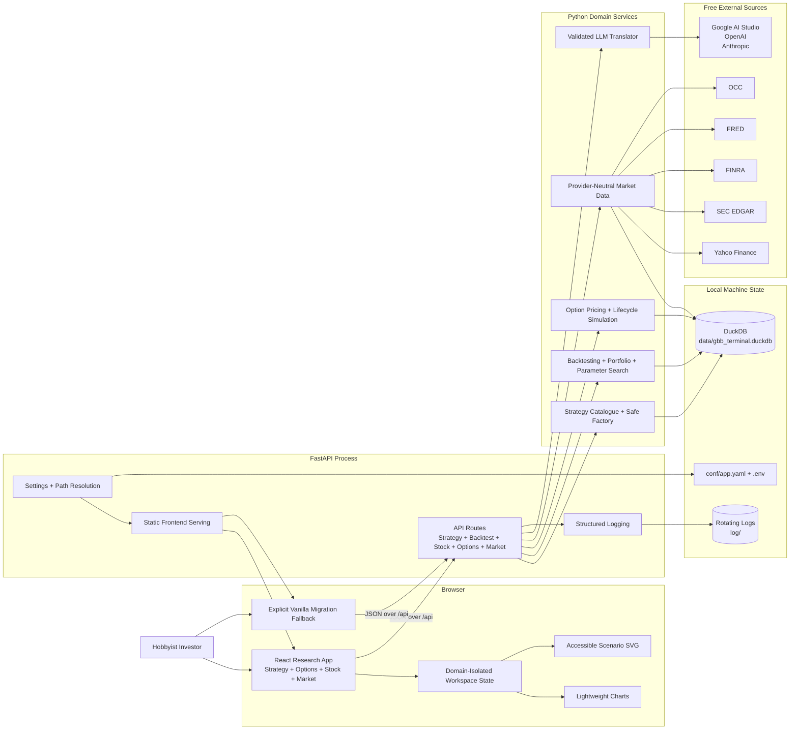
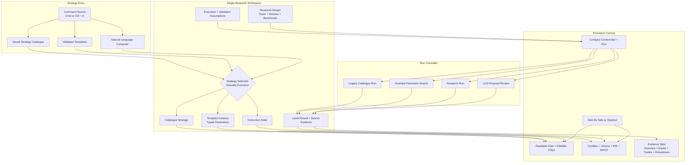
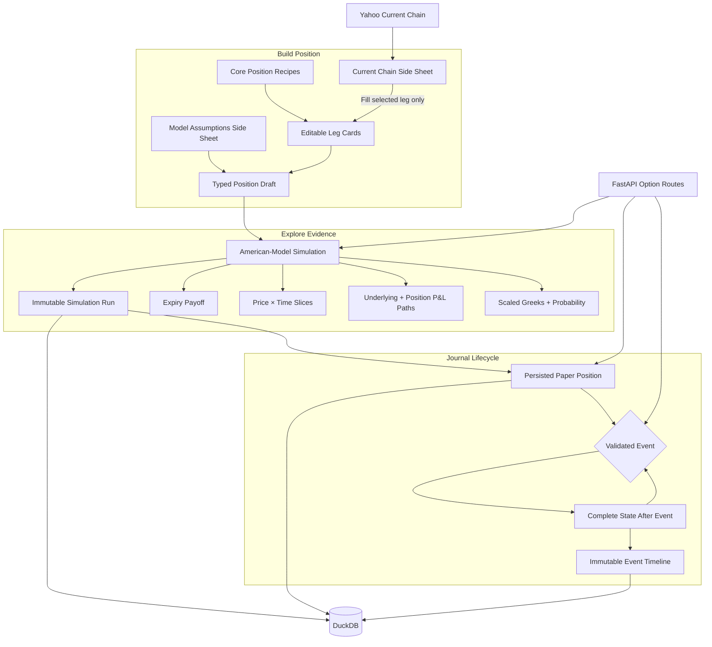
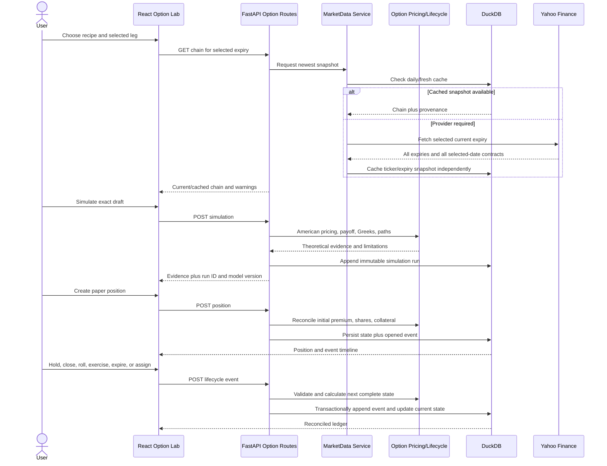
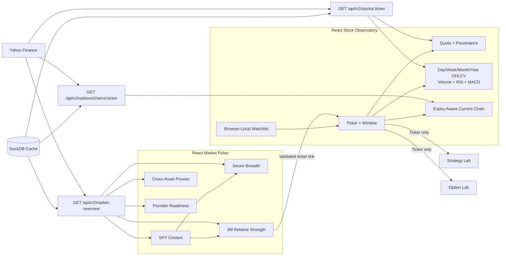
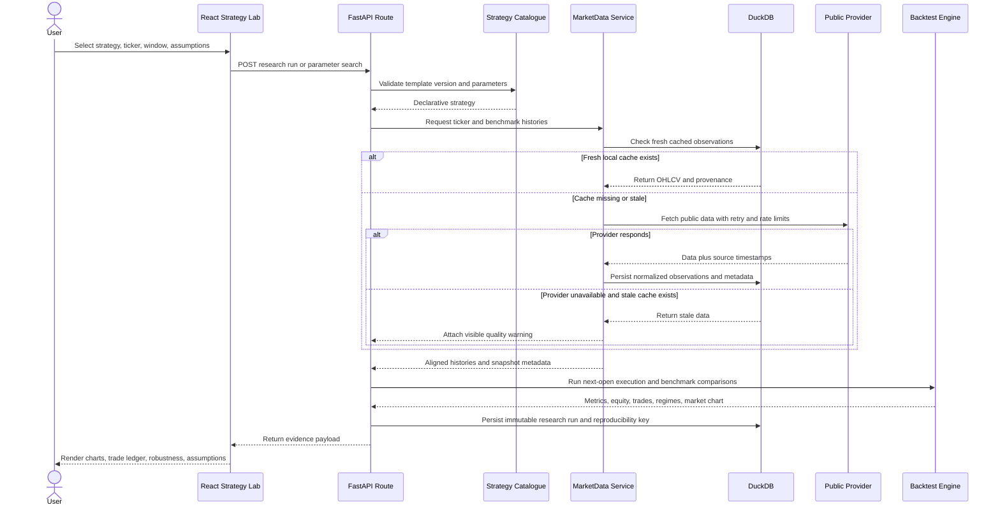
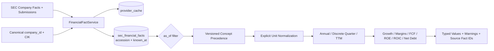
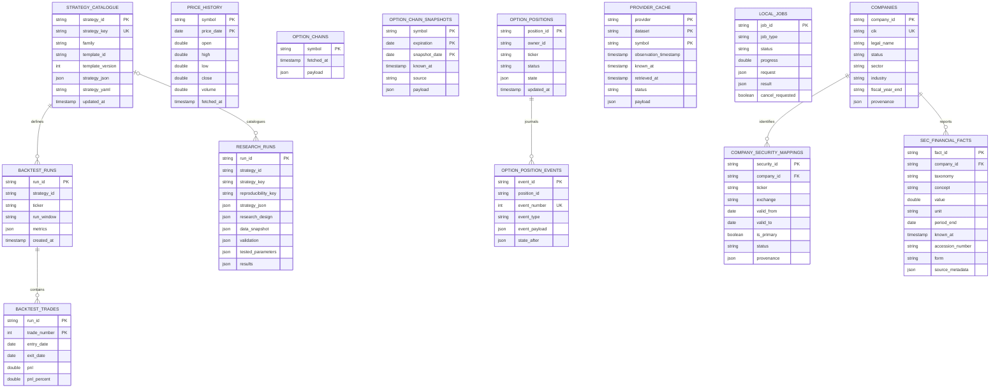
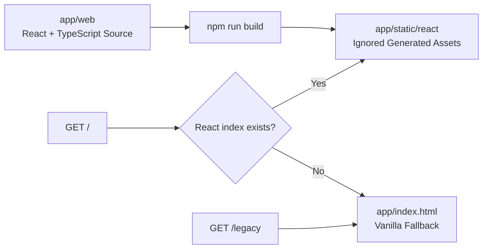

# GBB Terminal System Diagrams

These diagrams describe the current local-first architecture. They distinguish generated frontend assets, application services, external providers, and persisted research records.

## Runtime Architecture

## Frontend Research Canvas

The reducer clears incompatible selection data whenever the user switches among an instruction, template, or saved strategy. Canvas layout preference is presentation-only browser state and does not enter strategy identity or research reproducibility.

## Frontend Option Lifecycle Canvas

Simulation state and persisted ledger state are intentionally separate. Editing a new draft invalidates stale scenario evidence but never rewrites an earlier paper-position event. The browser sends only validated JSON option contracts; all pricing, collateral, cash, share, and realized-P&L transitions remain in Python.

## Option Lifecycle Request Sequence

## Frontend Observability Canvases

Stock and market state never becomes strategy identity or option-position state. Cross-lab navigation carries only a validated symbol. Market overview rows fail independently, so an unavailable ETF or macro proxy remains visible with warnings while successful current or cached rows continue rendering.

## Research Run And Data Retrieval

## Company Intelligence Metric Pipeline

Provider extraction does not choose business metrics. The intelligence engine can be rerun deterministically against the same `as_of` boundary and definition version, while every result retains source-fact lineage.

## DuckDB Logical Model

The relationships shown are logical domain relationships; DuckDB does not currently declare every one as a foreign-key constraint. Cache tables are intentionally independent so provider outages and schema evolution do not block research records.

## Frontend Build And Fallback

When the React build exists, `/` serves Strategy Lab while `/?lab=options`, `/?lab=stock`, and `/?lab=market` select the other lazy-loaded canvases from the same generated application. Without generated assets, `/` falls back to the vanilla application. `/legacy` remains available until connected-browser parity gates allow explicit retirement.
