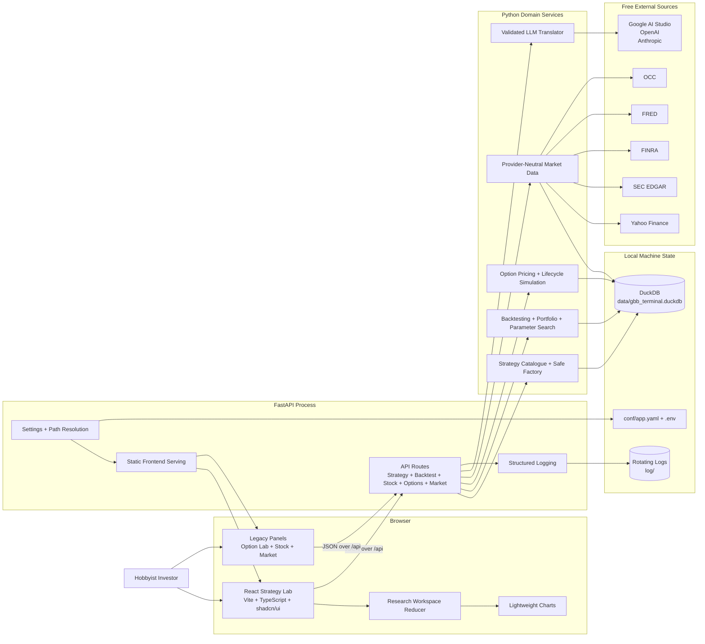
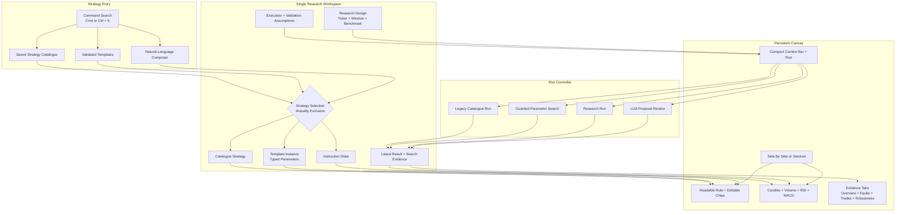
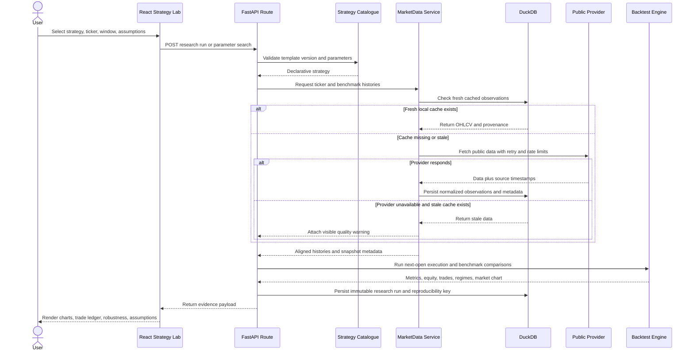
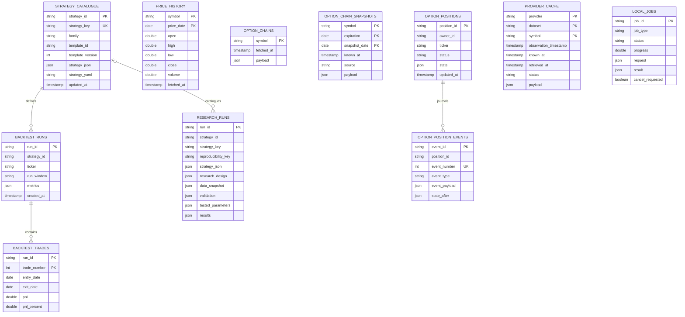
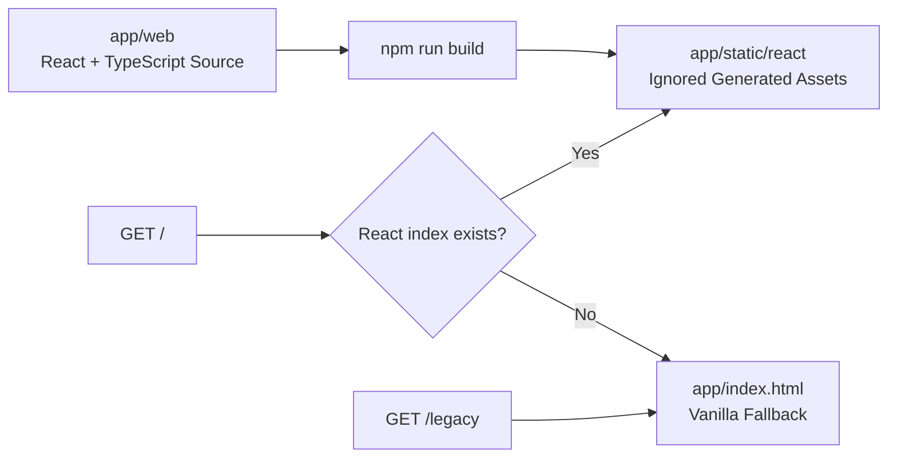

# GBB Terminal System Diagrams

These diagrams describe the current local-first architecture. They distinguish generated frontend assets, application services, external providers, and persisted research records.

## Runtime Architecture

## Frontend Research Canvas

The reducer clears incompatible selection data whenever the user switches among an instruction, template, or saved strategy. Canvas layout preference is presentation-only browser state and does not enter strategy identity or research reproducibility.

## Research Run And Data Retrieval

## DuckDB Logical Model

The relationships shown are logical domain relationships; DuckDB does not currently declare every one as a foreign-key constraint. Cache tables are intentionally independent so provider outages and schema evolution do not block research records.

## Frontend Build And Fallback

When the React build exists, `/` serves Strategy Lab from `app/static/react/`. Without generated assets, `/` falls back to the vanilla application. `/legacy` always remains available during the panel-by-panel migration.
